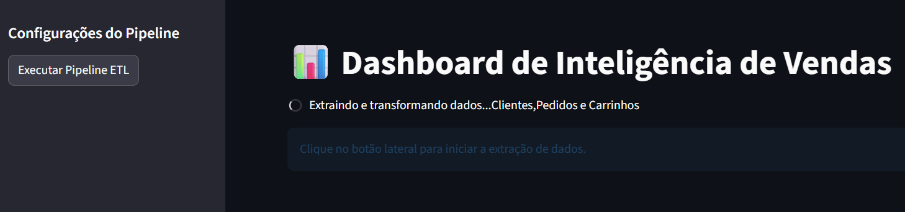
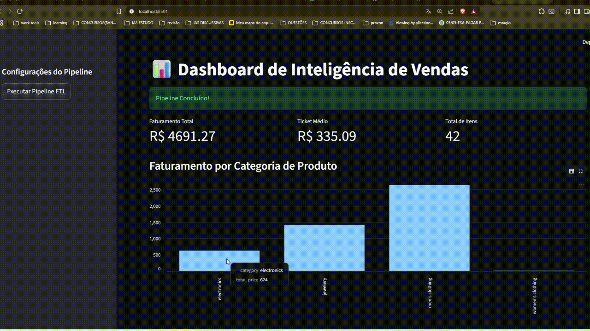
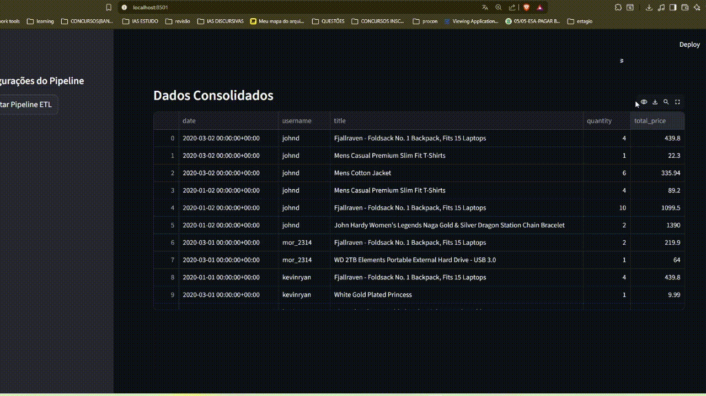
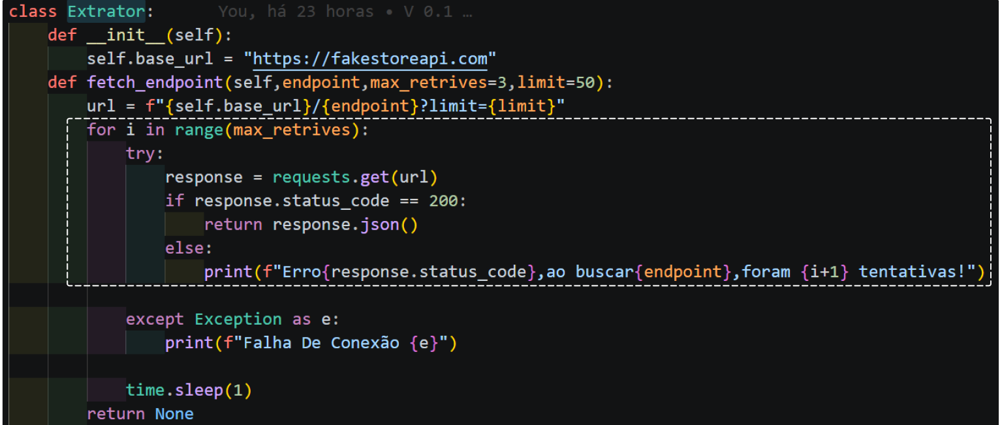

📊 Dashboard de Inteligência de Vendas - Delivery (Coco Bambu Style)
Este projeto simula um ecossistema de dados para uma operação de delivery de alto volume, como o Coco Bambu. O objetivo é transformar dados brutos de uma API pública em um Dashboard Executivo para suporte à tomada de decisão.

## 🖼️ Demonstração

resultado final: dados transformados em métricas de negócio. Aqui, podemos ver o faturamento consolidado e o ticket médio calculado após o cruzamento de três fontes diferentes de dados.

resultado final: os dados da api também são salvos em uma tabela caso necessário.Se for necessário armazenar em um banco de dados,essa tabela de visualização deve ser convertida para uma boa arquitetura MER.Pode-se notar que o a coluna data tem atributos multivaloradas,o que é um erro de F1(Os dados não estão em F1,Forma normal 1).Deixei o erro de propósito para fins educacionais,demonstrando a importância da normalização em arquiteturas MER (Modelo Entidade-Relacionamento) robustas.

Ponto 3 na prática,lógica responsável por tentar contato com a API algumas vezes para consumir esses dados antes de retornar erro ao usuário.

🧠 A Visão do Arquiteto
O projeto foi construído seguindo o princípio de Responsabilidade Única (SRP). Cada parte do código tem uma missão clara:

Extractor: O "garimpeiro" que busca os dados brutos.

Transformer: O "artesão" que limpa e cruza informações.

DatabaseManager: O "guardião" que garante a persistência no MySQL.

Pipeline: apenas coordena a execução entre as partes 

App (Streamlit): A "vitrine" que traduz números em insights visuais.

🚧 Desafios Técnicos e Superações
Durante o desenvolvimento, identifiquei limitações na fonte de dados que poderiam comprometer a qualidade do dashboard. Abaixo, explico como contornei cada uma:

0. Adaptação de Domínio: não achei uma API que simula exatamente o contexto de restaurantes.a mais proxima que achei foi uma api que simula um e-comerce.então tive que usá-la.Então,Apliquei uma camada de abstração no Transformer para tratar os dados de forma que simulassem métricas reais de delivery (como Ticket Médio por pedido).

1. Problema do "Dashboard Vazio" (Limitação da API)
Limitação: Por padrão, a API retornava apenas 10 a 20 registros, o que tornava os gráficos irrelevantes para uma análise de negócio.

Solução: Implementei um parâmetro de limit=50 dinâmico na URL de extração.

Motivo: Isso forçou a API a entregar o volume máximo de dados disponível, permitindo uma visualização de tendências mais robusta.

2. Dados Desconexos (Cruzamento de Informações)
Limitação: Os dados de vendas (Carts) vinham apenas com IDs, sem nomes de produtos ou preços.

Solução: Desenvolvi um método de Merge (JOIN) no Pandas que unifica Carts, Products e Users em uma única tabela mestre.

Motivo: Isso permitiu calcular o Faturamento Total e o Ticket Médio, transformando dados técnicos em métricas de negócio reais.

3. Instabilidade de Conexão
Limitação: APIs externas podem falhar momentaneamente.

Solução: Implementei uma lógica de Retries (tentativas) no Extrator com pausas (time.sleep) entre elas.

Motivo: Garante que o pipeline seja resiliente e não quebre por instabilidades temporárias de rede.

🛠️ Tecnologias Utilizadas
Pandas: Escolhido pela eficiência no tratamento de grandes volumes de dados e facilidade em operações de merge.

SQLAlchemy: Implementado como camada de abstração (ORM) para garantir que a troca de banco de dados (ex: MySQL para PostgreSQL) seja transparente para o código.

Python 3.13: Versão mais recente para aproveitar melhorias de performance e tipagem.
Ambiente: Virtualenv (.venv) para isolamento de dependências

Streamlit: Escolhido por ser simples e prático para aplicar.

🌟 Diferenciais do Projeto
Resiliência: Lógica de exponential backoff (tentativas com espera) para lidar com quedas de conexão.

Escalabilidade: Código modularizado que permite adicionar novas fontes de dados apenas criando novos métodos no Extractor.

Data Quality: Implementação de filtros de validação para garantir que registros inconsistentes (ex: quantidades negativas) não cheguem ao dashboard.

🚀 Como Executar
Clone o repositório:

Bash
git clone https://github.com/seu-usuario/Api-dashboard-python.git
Ative o ambiente virtual:

Bash
.\.venv\Scripts\activate
Instale as dependências:

Bash
pip install -r requeriments.txt
Inicie o Dashboard:

Bash
streamlit run src/app.py